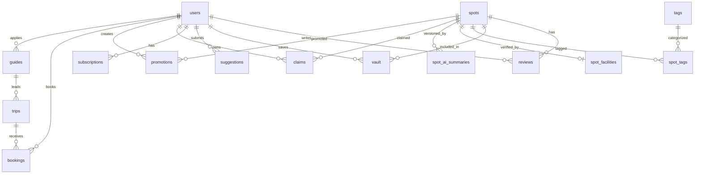

# Database Schema — FOMO

**ORM:** Prisma (PostgreSQL)  
**Konvensi:** `snake_case` untuk kolom & tabel, UUID sebagai primary key

---

## Diagram Relasi (ERD)

---

## Phase 1 — MVP (9 Tabel)

### 1. `users`

Menyimpan akun pengguna yang terautentikasi via Google OAuth.

| Kolom | Tipe | Constraint | Deskripsi |
|-------|------|------------|-----------|
| `id` | UUID | PK, `@default(uuid())` | |
| `google_id` | VARCHAR(255) | UNIQUE | Sub dari Google OAuth |
| `email` | VARCHAR(255) | UNIQUE | |
| `alias` | VARCHAR(100) | NULLABLE | Nama tampilan |
| `avatar_url` | TEXT | NULLABLE | Foto profil |
| `role` | ENUM('user', 'admin') | DEFAULT 'user' | |
| `preferences` | JSONB | NULLABLE | Preferensi filter dll |
| `created_at` | TIMESTAMPTZ | `@default(now())` | |
| `updated_at` | TIMESTAMPTZ | `@updatedAt` | |

**Relasi:** one-to-many → `reviews`, `vault`, `suggestions`, `claims`, `promotions`, `bookings`  
**Relasi:** one-to-one → `subscriptions`, `guides`

---

### 2. `spots`

Data tempat/kafe yang menjadi inti platform.

| Kolom | Tipe | Constraint | Deskripsi |
|-------|------|------------|-----------|
| `id` | UUID | PK | |
| `name` | VARCHAR(255) | | Nama tempat |
| `description` | TEXT | NULLABLE | Deskripsi |
| `address` | TEXT | NULLABLE | Alamat lengkap |
| `latitude` | DECIMAL(10,7) | | Presisi ~1 meter |
| `longitude` | DECIMAL(10,7) | | Presisi ~1 meter |
| `photo_urls` | TEXT[] | | Array URL foto |
| `fomo_score` | INT | DEFAULT 0 | 0–100 |
| `ai_vibes_summary` | TEXT | NULLABLE | AI-generated summary |
| `is_active` | BOOLEAN | DEFAULT true | Soft delete |
| `created_at` | TIMESTAMPTZ | | |
| `updated_at` | TIMESTAMPTZ | | |

**Index:** `(@index([latitude, longitude]))` — geospatial query  
**Relasi:** one-to-many → `reviews`, `vault`, `spot_tags`, `claims`, `promotions`, `spot_ai_summaries`  
**Relasi:** one-to-one → `spot_facilities`

---

### 3. `tags`

Master data untuk amenity tags (Wi-Fi, Colokan, dll).

| Kolom | Tipe | Constraint | Deskripsi |
|-------|------|------------|-----------|
| `id` | UUID | PK | |
| `name` | VARCHAR(50) | UNIQUE | 'Fast Wi-Fi', 'Plugs' |
| `icon` | VARCHAR(10) | | Emoji: 📶, ⚡ |
| `category` | VARCHAR(50) | | 'amenity', 'vibe' |

**Relasi:** many-to-many → `spots` (via `spot_tags`)

---

### 4. `spot_tags`

Join table many-to-many `spots` ↔ `tags`.

| Kolom | Tipe | Constraint |
|-------|------|------------|
| `spot_id` | UUID | FK → spots, PK komposit |
| `tag_id` | UUID | FK → tags, PK komposit |

**Cascade:** `onDelete: Cascade` di kedua FK

---

### 5. `reviews`

Ulasan pengguna. Akan diproses oleh AI worker secara async.

| Kolom | Tipe | Constraint | Deskripsi |
|-------|------|------------|-----------|
| `id` | UUID | PK | |
| `spot_id` | UUID | FK → spots | |
| `user_id` | UUID | FK → users | |
| `content` | TEXT | | Isi ulasan |
| `wifi_rating` | INT | NULLABLE | Rating Wi-Fi 1-5 |
| `plugs_rating` | INT | NULLABLE | Rating colokan 1-5 |
| `noise_rating` | INT | NULLABLE | Rating kebisingan 1-5 |
| `is_processed` | BOOLEAN | DEFAULT false | Flag untuk AI worker |
| `created_at` | TIMESTAMPTZ | | |
| `updated_at` | TIMESTAMPTZ | | |

**Index:** `(@index([spot_id, created_at]))`, `(@index([user_id]))`  
**Relasi:** belongs-to → `spots`, `users`

---

### 6. `spot_facilities`

AI-verified facilities, 1:1 dengan spot. Diupdate oleh AI worker setelah analisis review.

| Kolom | Tipe | Constraint | Deskripsi |
|-------|------|------------|-----------|
| `id` | UUID | PK | |
| `spot_id` | UUID | FK → spots, UNIQUE | |
| `wifi_confidence` | INT | DEFAULT 0 | 0–100 |
| `plugs_confidence` | INT | DEFAULT 0 | 0–100 |
| `noise_level` | ENUM('quiet','moderate','loud') | NULLABLE | |
| `noise_confidence` | INT | DEFAULT 0 | 0–100 |
| `last_analyzed_at` | TIMESTAMPTZ | NULLABLE | |

---

### 7. `spot_ai_summaries`

Riwayat semua analisis AI untuk sebuah spot. Setiap kali AI memproses ulang, baris baru ditambahkan dengan `version` increment.

| Kolom | Tipe | Constraint | Deskripsi |
|-------|------|------------|-----------|
| `id` | UUID | PK | |
| `spot_id` | UUID | FK → spots | |
| `summary` | TEXT | | AI-generated summary text |
| `wifi_confidence` | INT | DEFAULT 0 | 0–100 |
| `plugs_confidence` | INT | DEFAULT 0 | 0–100 |
| `noise_level` | ENUM('quiet','moderate','loud') | NULLABLE | |
| `noise_confidence` | INT | DEFAULT 0 | 0–100 |
| `version` | INT | DEFAULT 1 | Auto-increment per spot |
| `created_at` | TIMESTAMPTZ | | |

**Index:** `(@index([spot_id, created_at]))`  
**Relasi:** many-to-one → `spots`

---

### 8. `suggestions`

Data dari form crowdsourcing "Have a Spot to Spill?" yang menunggu review admin.

| Kolom | Tipe | Constraint | Deskripsi |
|-------|------|------------|-----------|
| `id` | UUID | PK | |
| `alias` | VARCHAR(100) | | Nama pengirim |
| `contact_drop` | VARCHAR(255) | | Email pengirim |
| `the_intel` | TEXT | | Detail tempat |
| `status` | ENUM('pending','approved','rejected') | DEFAULT 'pending' | |
| `reviewed_by` | UUID | FK → users, NULLABLE | Admin yang mereview |
| `reviewed_at` | TIMESTAMPTZ | NULLABLE | |
| `created_at` | TIMESTAMPTZ | | |

**Index:** `(@index([status]))`

---

## Phase 2 — Monetisasi (6 Tabel)

### 10. `subscriptions`

Langganan FOMO Pro.

| Kolom | Tipe | Constraint |
|-------|------|------------|
| `id` | UUID | PK |
| `user_id` | UUID | FK → users, UNIQUE |
| `plan_type` | ENUM('monthly','yearly') | |
| `status` | ENUM('active','cancelled','expired') | |
| `start_date` | TIMESTAMPTZ | |
| `end_date` | TIMESTAMPTZ | |
| `payment_provider` | VARCHAR(100) | NULLABLE |
| `payment_id` | VARCHAR(255) | NULLABLE |

---

### 10. `claims`

Klaim kepemilikan spot oleh pemilik kafe (B2B).

| Kolom | Tipe | Constraint |
|-------|------|------------|
| `id` | UUID | PK |
| `spot_id` | UUID | FK → spots, UNIQUE |
| `owner_id` | UUID | FK → users |
| `status` | ENUM('pending','approved','rejected') | |
| `verified_by` | UUID | FK → users, NULLABLE |
| `verified_at` | TIMESTAMPTZ | NULLABLE |
| `created_at` | TIMESTAMPTZ | |

---

### 11. `promotions`

Kampanye promosi spot (CPM/CPC) untuk pemilik kafe.

| Kolom | Tipe | Constraint |
|-------|------|------------|
| `id` | UUID | PK |
| `spot_id` | UUID | FK → spots |
| `owner_id` | UUID | FK → users |
| `type` | ENUM('cpm','cpc') | |
| `budget` | DECIMAL(12,2) | |
| `bid_amount` | DECIMAL(12,2) | |
| `status` | ENUM('active','paused','ended') | |
| `impressions_delivered` | INT | DEFAULT 0 |
| `clicks_delivered` | INT | DEFAULT 0 |
| `start_date` | TIMESTAMPTZ | |
| `end_date` | TIMESTAMPTZ | |

---

### 12. `trips`

Paket tur OpenTrip.

| Kolom | Tipe | Constraint |
|-------|------|------------|
| `id` | UUID | PK |
| `title` | VARCHAR(255) | |
| `description` | TEXT | NULLABLE |
| `route` | JSONB | NULLABLE (array waypoint) |
| `price` | DECIMAL(12,2) | |
| `max_participants` | INT | |
| `guide_id` | UUID | FK → guides, NULLABLE |
| `is_active` | BOOLEAN | DEFAULT true |
| `created_by` | UUID | FK → users (admin) |
| `created_at` | TIMESTAMPTZ | |

---

### 13. `bookings`

Pemesanan tiket OpenTrip oleh user.

| Kolom | Tipe | Constraint |
|-------|------|------------|
| `id` | UUID | PK |
| `trip_id` | UUID | FK → trips |
| `user_id` | UUID | FK → users |
| `quantity` | INT | |
| `total_price` | DECIMAL(12,2) | |
| `status` | ENUM('confirmed','cancelled') | |
| `payment_status` | ENUM('pending','paid','refunded') | |
| `booking_date` | TIMESTAMPTZ | |

---

### 14. `guides`

Profil guide tur yang terverifikasi.

| Kolom | Tipe | Constraint |
|-------|------|------------|
| `id` | UUID | PK |
| `user_id` | UUID | FK → users, UNIQUE |
| `bio` | TEXT | NULLABLE |
| `experience` | TEXT | NULLABLE |
| `status` | ENUM('pending','approved','rejected') | |
| `verified_by` | UUID | FK → users, NULLABLE |
| `verified_at` | TIMESTAMPTZ | NULLABLE |
| `created_at` | TIMESTAMPTZ | |

---

## Konvensi

| Aturan | Standar |
|--------|---------|
| **Primary Key** | UUID v4 (bukan auto-increment) |
| **Foreign Key** | `{table}_id` → `@db.Uuid` |
| **Timestamps** | `created_at`, `updated_at` |
| **Soft Delete** | `is_active` di Spot (bukan hapus) |
| **Enum** | Prisma native enum → PostgreSQL enum |
| **JSON** | `JsonB` untuk data fleksibel |
| **Naming** | `snake_case` di DB, `camelCase` di Prisma (via `@map`) |
| **Index** | Foreign key + kolom yang sering difilter/diurut |
| **Cascade** | `onDelete: Cascade` untuk relasi anak |
